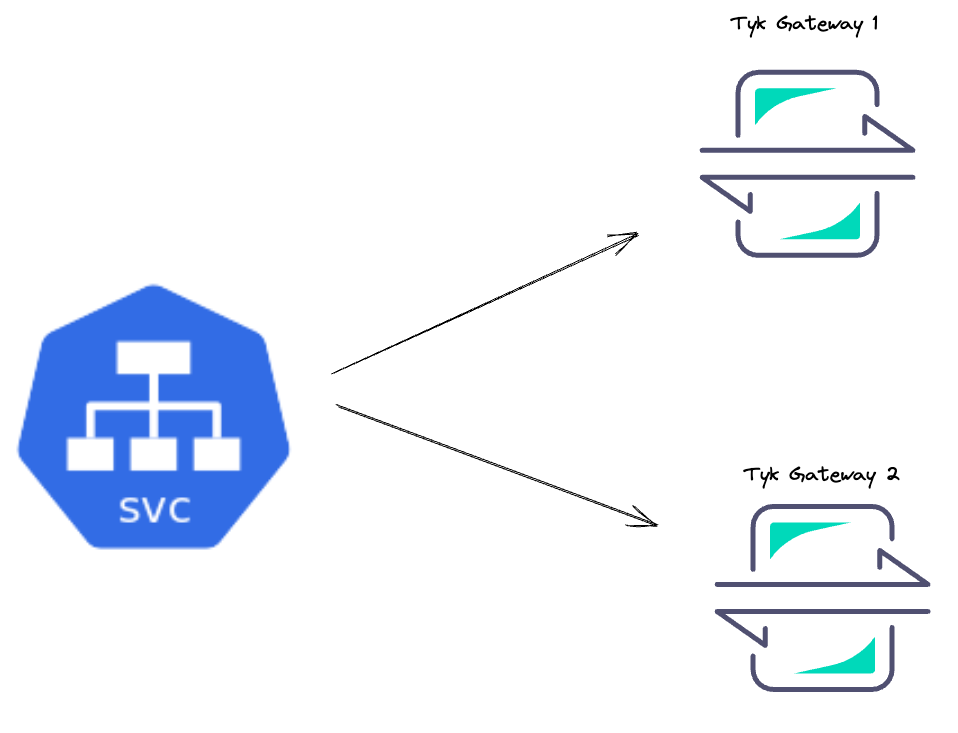
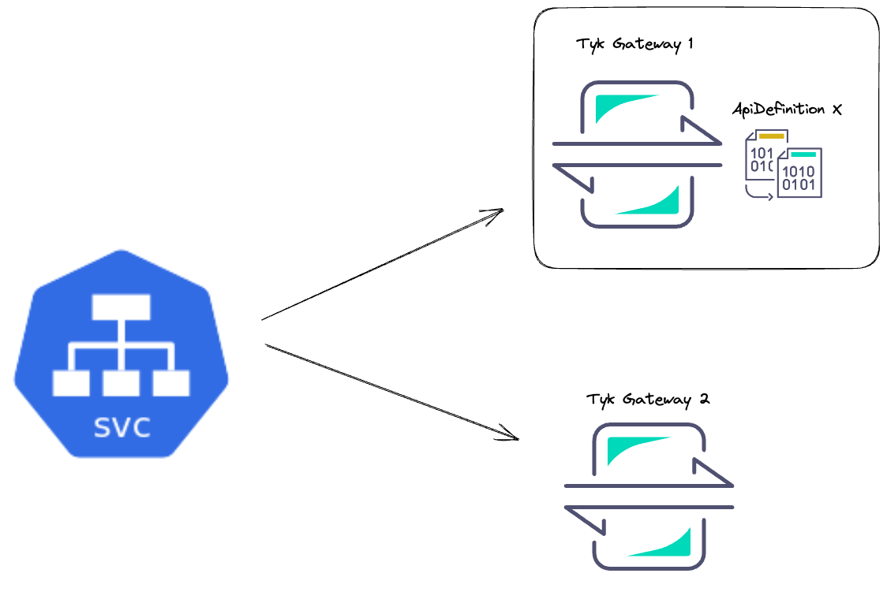
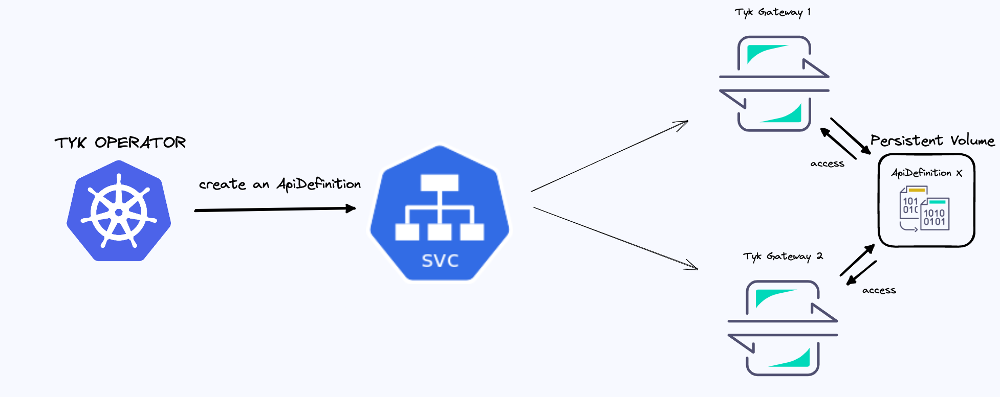

# Multiple Tyk Gateway

## Problem

Previously, running multiple instances of Tyk Gateway without Tyk Dashboard causes a synchronization issue.

Assume that you have the following setup:



The service object forwards incoming requests to one of the Tyk Gateway pods. Eventually, your ApiDefinition will
be saved one of the Pod which handled the request. So, other Pod is unaware of existence of this ApiDefinition.

For example, let's suppose the ApiDefinition is created on `Tyk Gateway 1`.



At the moment, since `Tyk Gateway 2` does not have `ApiDefinition X`, any incoming requests regarding `ApiDefinition X` cannot be processed properly on `Tyk Gateway 2`.

For example, If you send a HTTP request to Service in order to retrieve `ApiDefinition X`, you may face with 404 response because your request might be
forwarded to a pod where the ApiDefinition was not created.

## Demo

To solve this problem, you can use `Persistent Volumes` with Tyk Operator.

Each Gateway pod will use shared persistent volumes, so that each of them can access to same files. However, this is not enough. Since Gateway requires hot-reloads, you need to send additional group reload request each time. Tyk Operator helps us to solve this.



--- 

### Prepare environment

- Create a cluster
```bash
kind create cluster --config ./manifests/kind.yaml
```
> If you are using other clusters, Minikube or Cloud Providers, please update [`Persistent Volume`](./manifests/gw-pv.yaml) 
according to your cluster information.

- Install Tyk Gateway, Tyk Operator and their dependencies
```bash
./install.sh
```

> This script depends on `helm` and `kubectl`.
